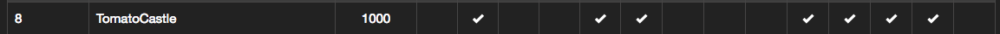

# SECCON Beginners 2018 広島 に行ってきた

### 目次
- Introduction  
- Crypto(暗号)の講義内容  
- Webの講義内容  
- Binaryの講義内容  
- CTFの内容  
- 感想や他の人の参加記等  

### 行った理由
こないだ行われたSECCON Beginners 2018 CTFでは全然解けずひどかったので参加したかったのです

### 勉強会の内容
- Crypto(暗号)の講義  
- Webの講義  
- Binaryの講義  
- やさしいCTF(2時間ぐらいだったかな?)  
- 交流会  

## Crypto(暗号)講義の非常に大雑把な内容
- modの求め方  
- 逆元の求め方  
- RSA(現在使用されている公開鍵暗号方式)の概要  

### Crypto(暗号)講義の感想
勉強会の中だけでは理解できなかったので復習必要だと感じました  
つまり？　　

### すうが くだいじ

## Web講義の大雑把な内容
- XSSについて 
- XSSを利用してCokkiを取得する方法
-  XSSを利用してユーザーエージェントを取得する方法(こないだのCTFの問題) 

### XSSとは？
ユーザから入力される内容を表示するサイトで、そのフォームに`)`を忍ばせて、こちらが用意したサイトにアクセスさせ、相手のクライアント情報の中にあるflagを取得しました。

### 問題: Contact Re-Revenge
- 先程のContact Revengeとは違い`<script>`タグが入力不可な問題でした。
- 僕は`` という手を無理やり使ってscriptを使用せずにアクセスをさせて、flagを取得しました。
- 他の人に聞いてみると、実は判定が曖昧で`<Script>`など、文字を一部大文字にするだけでもアクセスできた模様です。

### 問題: Raw
- 僕は解けませんでした...
- どうやらバイナリデータの中にFLAGが書かれた文字があったらしいです...
- Kaitoさんはradare2を使用して見つけ出されたそうです。

### 問題: Review
- アセンブリ言語を読んで、最後のRawの値を答えるとFlagが出力される問題です。
- binaryの講習内で行ったものと似たようなものでした。

### その他
- CTF中に作業妨害BGMが流れました。
- 実際のCTFでも妨害BGMが流れるそうです。

## 今回参加した感想
- しゅういちさん、Kaitoさん、なんばつさん、はいひるさんなどなど、色々な方と喋れて楽しかったです！
- またどこかでお会いしたいです..!
- 数学 頑張る…(^q^)
- 関西でも開催してほしい！！！

## 他の方の参加記
他の方の参加記のほうが詳しく書かれていますので、そちらも是非御覧ください
- [しゅういちさん](ups.hatenablog.jp/entry/2018/09/03/SECCON_Beginners_広島行ってきた)
- [はすみさん](mwc922-hsm.hatenablog.com/entry/2018/09/01/234729)
- [Kaitoさん](https://github.com/tMasaaa/ctf/blob/master/seccon_beginners_hiroshima/blog/blog.md)